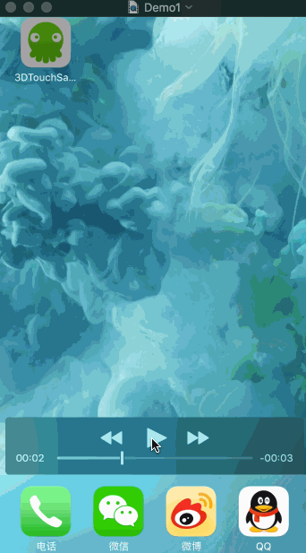
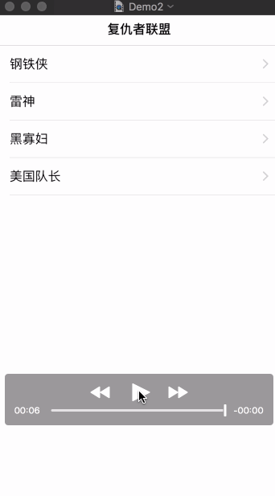

###前言
半个月前拿到iPhone6S，第一时间体验了3D-Touch，感觉真的很赞，但是遗憾的是除了微信微博和苹果官方的App之外，其他App几乎没有对相关功能做3D-Touch的支持，于是第一时间在自家App做了相关的实践，经过一段时间的使用，效果还不错，昨晚写了这个Demo分享给大家，希望大家喜欢。
###实现
3D-Touch的功能分为两个部分：Shortcut和Preview。

Shortcut和Preview效果如下图：

